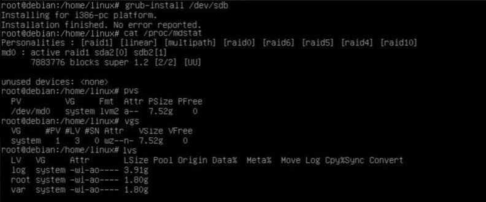

# Лабораторная работа №2 (RAID)

Задание 1 (Установка ОС и настройка LVM, RAID)

Установка grub

Данные об physical volumes, volume groups, logical volumes выводятся с помощью выше использованных команд.

# Вывод

В данном задании выяснилось, как устанавливать OC Linux, настраивать LVM и RAID, и использовать такие команды, как:

* fdisk -l *+pvs,lvs,vgs
* lsblk -o NAME,SIZE,FSTYPE,TYPE,MOUNTPOINT
* cat /proc/mdstat
* grub-install /dev/XXX
* dd if=/dev/xxx of=/dev/yyy

# Задание 2 (Эмуляция отказа  одного из дисков)